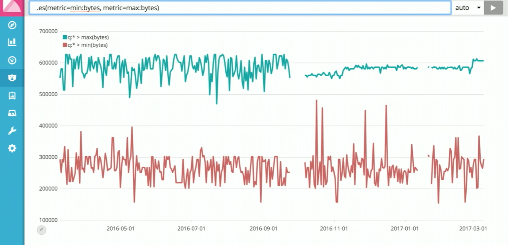
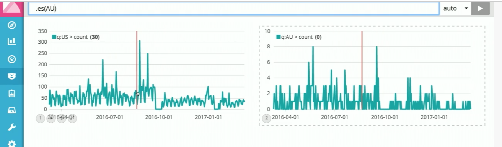
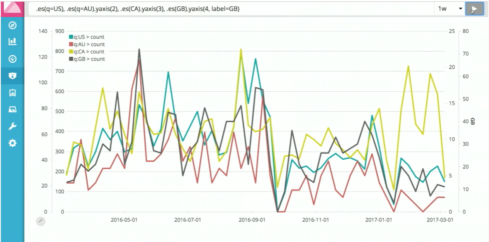
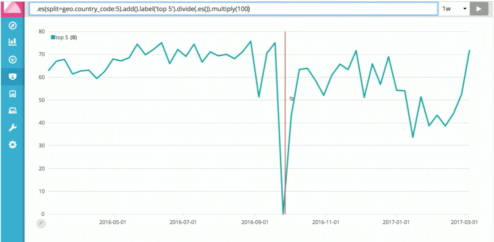
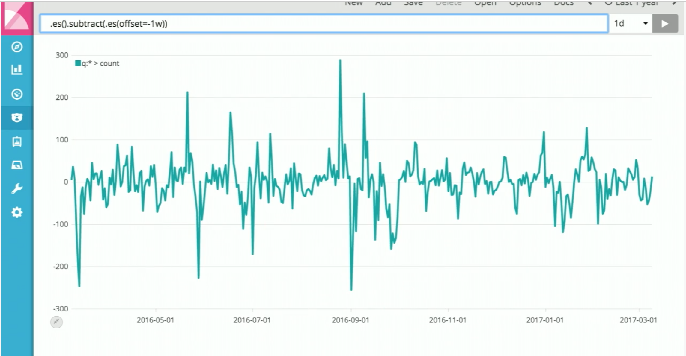
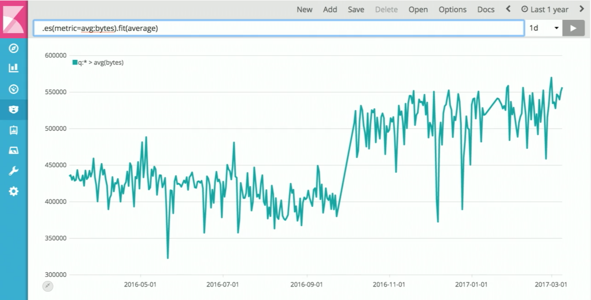
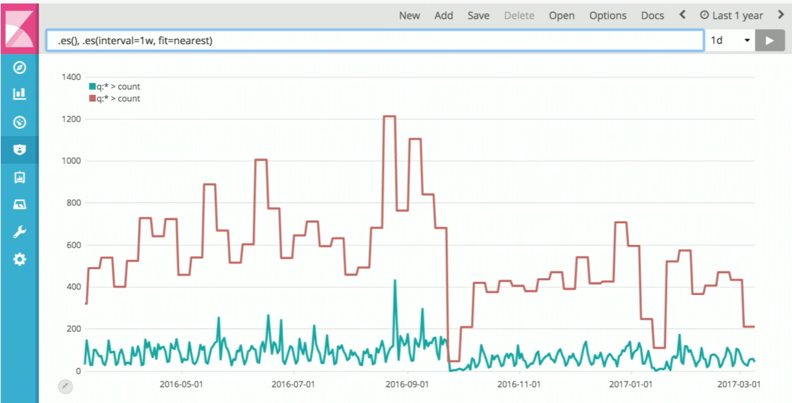
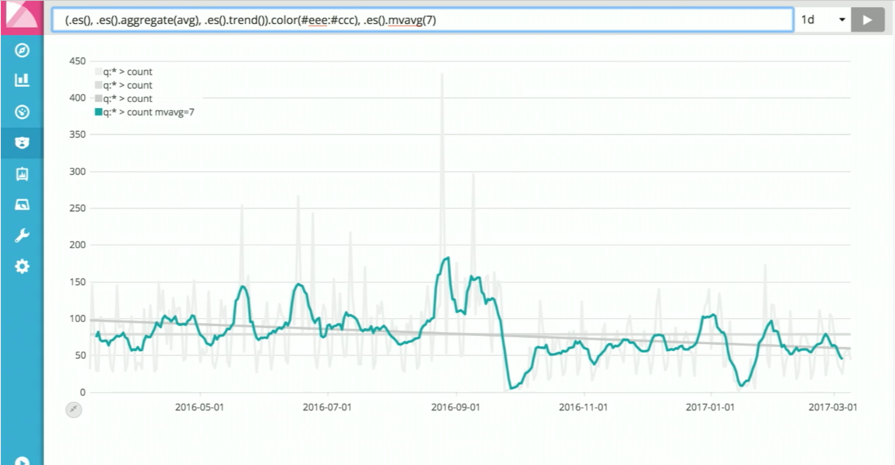
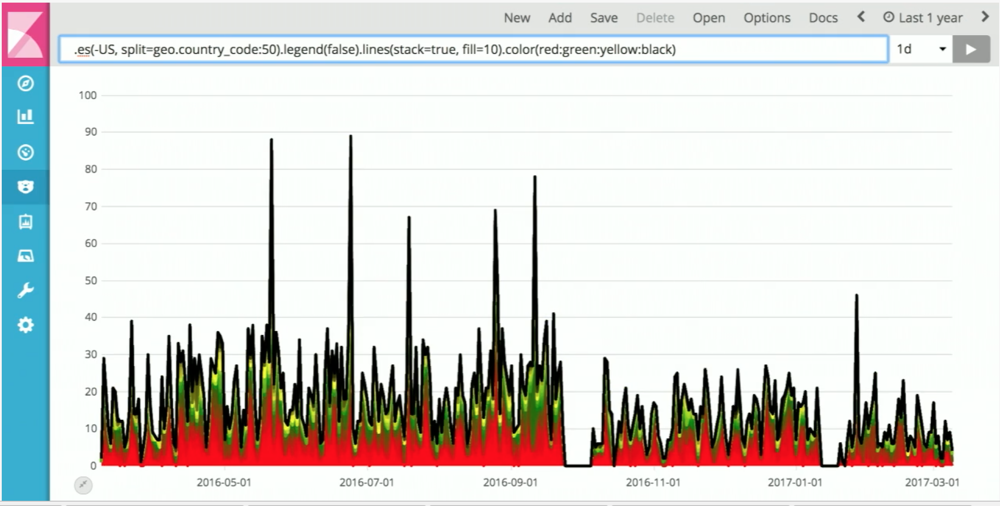

Timelion recepies
========================================================

Put 2 graphs on 1 chart
--------------------------------------------------------

Supply queries multiple times
--------------------------------------------------------
.. image:: _static/multiple_queries.png

Leverage ES terms aggregation to avoid explicit values typing
-----------------------------------------------------------------

Here we select top 5 countries using ES terms aggregation

.. image:: _static/top_5_using_terms_aggregation.png

Compare 2 charts side-by-side
--------------------------------------------------------

Having multiple queries on the same chart
--------------------------------------------------------

We combine here several graphs, each having it's own y-axis, and also label defined for axis #4,

Using ``range()`` function to align values scale
--------------------------------------------------------

What if we just need to compare shapes, and we don't have explicit names for the countries?
Use range() function and terms aggregation using split()

.. code-block:: javascript

    .es(split=geo.country_code:5).range(0,100)

.. image:: _static/multiple_queries_combine_using_split_and_range.png

Using formulas and computations to calculate percentage
----------------------------------------------------------------

Requirement: Show how much percents of total traffic volume make top 5 countries

Solution:

We will need to implement formula:

.. code-block:: javascript

    "top 5 percents" = "traffic from top 5 countries" / "total traffic volume" * 100

This is how it will look in timelion language

.. code-block:: javascript

    .es(split=geo.country_code:5).add().label("top 5").divide(.es()).multiple(100)

Derivative functions (how data is changing)
--------------------------------------------------------

Shows speed of change in data

.. code-block:: javascript

    .es().derivative()

Acceleration

.. code-block:: javascript

    .es().derivative().derivative()

Using offsets to compare series from different periods side by side
---------------------------------------------------------------------

Requirement: show how traffic from today compares to traffic from past week

Solution: use ``offset`` argument of datasource query.

.. code-block:: javascript

    .es(), .es(offset=-1w)

.. image:: _static/offset.png

And using subtract we can show difference between corresponding times

.. code-block:: javascript

    .es().subtract(.es(offset=-1w))

Filling blanks
----------------------------------------------------------------

``fit()``
^^^^^^^^^^^^^^^^^^^^

Requirement: series have a gap in the timeline, where we don't have data. Need to fill this gap 

Solution: use ``fit`` function. This function takes an argument, which determine how exactly to connect the line.
 
.. code-block:: javascript

    .es(metric=avg:bytes).fit(average)

Interval
----------------------------------------------------------------

``fit=nearest``
^^^^^^^^^^^^^^^^^^^^^^

.. code-block:: javascript

    .es(), .es(interval=1w, fit=nearest)

``fit=scale``
^^^^^^^^^^^^^^^^^^^^^^

.. code-block:: javascript

    .es(), .es(interval=1w, fit=scale)

Smoothing and moving averages
----------------------------------------------------------------

``mvavg()``
^^^^^^^^^^^^^^^^^^^^^^

.. code-block:: javascript

    (.es(), .es().aggregate(avg), .es().trend()).color(#eee:#ccc), es().mvavg(7)

Exponential smoothing
^^^^^^^^^^^^^^^^^^^^^^

.. code-block:: javascript

    .es(), .es().holt(0.3, 0.8, 1w)

Various styling
----------------------------------------------------------------
.. code-block:: javascript

    .es(-US, split=geo.country_code:50)
        .legend(false)
            .lines(stack=true, fill=10)
                .color(red:green:yellow:black)

