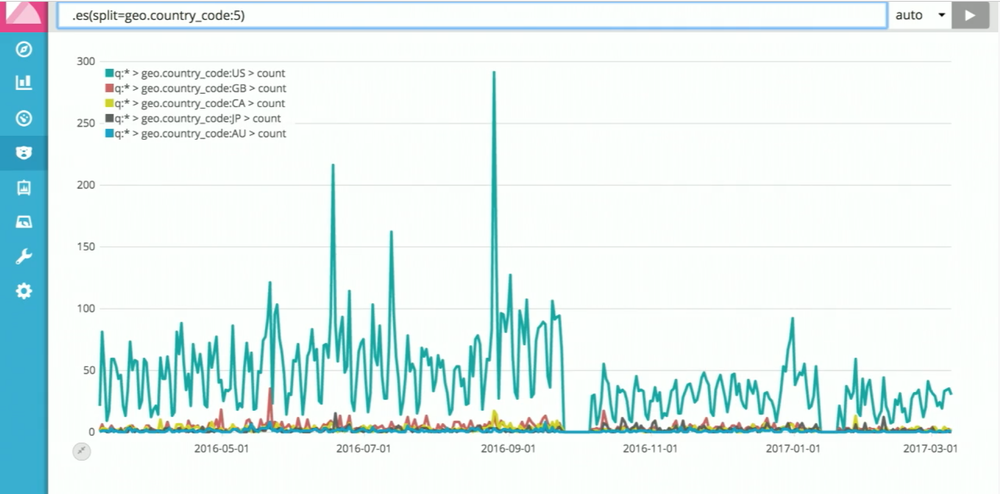
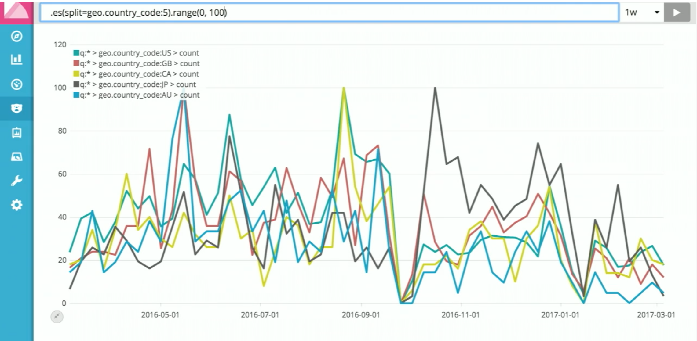
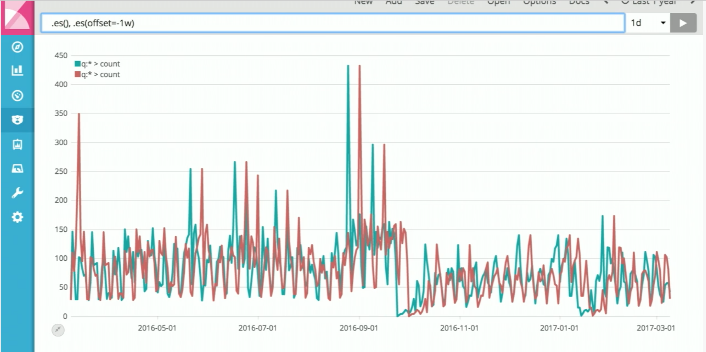

# Kibana cookbook

Based on tutorial by Rashid Khan https://www.elastic.co/elasticon/conf/2017/sf/timelion-magic-math-and-everything-in-the-middle
 

## Put 2 graphs on 1 chart


## Supply queries multiple times


## Leverage ES terms aggregation to avoid explicit values typing

Here we select top 5 countries using ES terms aggregation



## Compare 2 charts side-by-side


## Having multiple queries on the same chart

We combine here several graphs, each having it's own y-axis, and also label defined for axis #4,


## Using range() function to align values scale
  
What if we just need to compare shapes, and we don't have explicit names for the countries?
Use range() function and terms aggregation using split()

```
.es(split=geo.country_code:5).range(0,100)
```




## Using formulas and computations to calculate percentage
 
Requirement: Show how much percents of total traffic volume make top 5 countries

Solution:

We will need to implement formula:
```
"top 5 percents" = "traffic from top 5 countries" / "total traffic volume" * 100
```
This is how it will look in timelion language
```
.es(split=geo.country_code:5).add().label("top 5").divide(.es()).multiple(100)
```


## Derivative functions (how data is changing)

Shows speed of change in data
```
.es().derivative()
```
Acceleartion
```
.es().derivative().derivative()
```


## Using offsets to compare series from different periods side by side

Requirement: show how traffic from today compares to traffic from past week

Solution: use `offset` argument of datasource query. 

```
.es(), .es(offset=-1w)
```


And using subtract we can show difference between corresponding times

```
.es().subtract(.es(offset=-1w))
```


